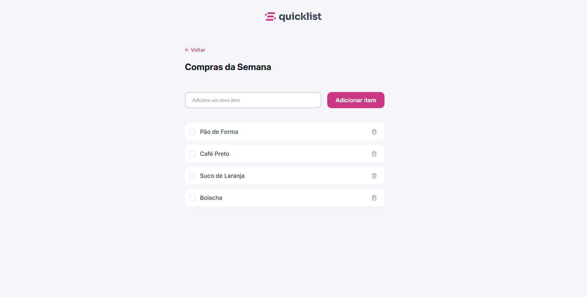

# Projeto: Lista de Compras

## Descrição
Este é um projeto HTML, CSS e JavaScript
 - Utilizei variáveis para cores
 - Utilizei classes para estilização no CSS
 - HTML foi bem organizado e classes são de fácil entedimento para estilizações no CSS
 - Estruturei o projeto em pastas
 - Utilizei JavaScript Puro para interação com o usuario, removendo um item e adicionado um item a lista

 ```
|-src
    |- assets
        |- imagens-usadas
    |- style
        |- style.css
    |- script
        |- index.js
|- index.html
|- README.md
```



## Como Executar o Projeto

1. Clone ou baixe o repositório.
   ```bash
   git clone https://github.com/henrymzs/shopping-list.git
   ```

2. Navegue até a pasta do projeto.
   ```bash
   cd nome-do-repositorio
   ```

3. Abra o arquivo `index.html` no navegador com a extensão do vscode (live server).

---